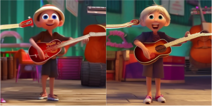
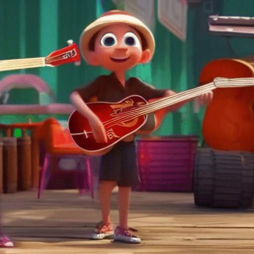

# DreamDance: Personalized Text-to-video Generation by Combining Text-to-Image Synthesis and Motion Transfer

## Results of Pipeline 1

## Results of Pipeline 2

Input images of prompt: miguel playing guitar on the street, pixar, cartoon, high quality, full body, single person

Output video

Input images of prompt: miguel running in a forest, pixar, cartoon, green eyes, red hat, high quality, standing, full body, single person

Output video

Input images of prompt: miguel in a forest, pixar, cartoon, green eyes, red hat, high quality, standing, full body, single person

Output video

Input images with prompt: miguel, pixar, cartoon, playing guitar, high quality, full body, single person

Output video

We noticed that if the changes are even larger, the interpolation still handled the video synthesis pretty well. Although the are some artifacts in the mid-frames, our limitations are mainly from the input image generation side. If future text-to-image synthesis models have the capability of generating more promising images with high consistency of all the factors above, frame interpolation will be a powerful method of text-to-video generation.
